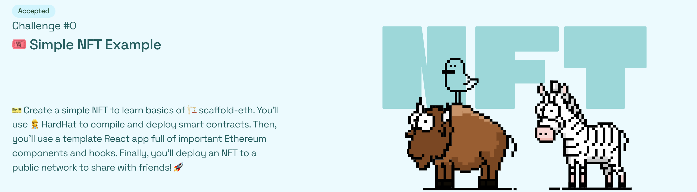
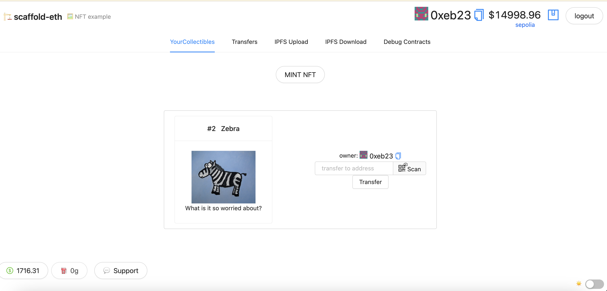

# 🏗 scaffold-eth | 🏰 BuidlGuidl

🎫 Create a simple NFT to learn basics of 🏗 scaffold-eth. You'll use [👷‍♀️ HardHat](https://hardhat.org/getting-started/) to compile and deploy smart contracts. Then, you'll use a template React app full of important Ethereum components and hooks. Finally, you'll deploy an NFT to a public network to share with friends! 🚀

🌟 The final deliverable is an app that lets users purchase and transfer NFTs. 

YourCollectible Contract
CODE: https://sepolia.etherscan.io/address/0x83eBa918786caD197284Bc2016A399631b9dBD71#code

DEMO: https://ruddy-acoustics.surge.sh/

🏗 contract deploy on Ethereum Sepolia Testnet 🏗
